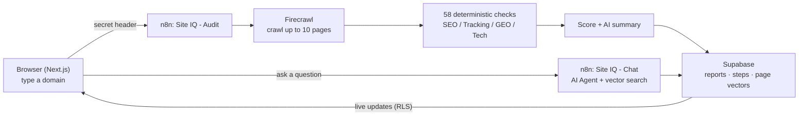

# Site IQ - Site Intelligence Studio

> Type in a website. Get a clear **0-100 score (A-F)** for its SEO, tracking, AI-readiness and tech
> basics - with a plain-English summary, a prioritized to-do list, and a **chat you can ask about the
> site**. The heavy lifting runs in an **n8n** automation; the app just triggers it and shows the result.

**[Live demo →](https://siteiq.monkata.ai)** · **[See a sample report →](https://siteiq.monkata.ai/sample)** (no sign-up needed)

---

## In plain words

Imagine you paste `stripe.com` into a box and press **Audit**. A few minutes later you get a report card:

- a big **score and grade** (e.g. **D - 68/100**),
- four sub-scores: **SEO**, **Tracking & Analytics**, **AI-Readiness (GEO)**, **Tech Basics**,
- a short **executive summary** written in normal language,
- a **findings list** sorted by "biggest win for least effort",
- and a **chat box** where you can ask *"is there a pricing page?"* or *"what does this site sell?"* and
  get answers **based only on that site's actual pages**.

That's it. You don't need to know SEO jargon - the report explains itself.

### Try it - three examples

| You type | You get | Then you can ask the chat |
|---|---|---|
| `stripe.com` | **D - 68.** Great SEO & tech; tracking reads low (their tags load via Google Tag Manager at runtime, which a crawler can't see - the report says so honestly). | *"Does this site mention pricing?"* → it points you to the pricing page. |
| `vercel.com` | **D - 65**, up to 10 pages audited, sitemap found, AI crawlers not blocked. | *"What products does this site offer?"* → AI Cloud, CDN, CI/CD… with links. |
| a broken/unreachable site | A clean **"the audit could not be completed"** - never an endless spinner. | (n/a) |

---

## Is it "AI"? How smart is it?

Yes - but deliberately in the right places:

- **The score is NOT guessed by an AI.** It's computed by **58 deterministic rules** (does the page have a
  title 15-60 chars? a canonical tag? HTTPS? Consent Mode v2? a sitemap? …). Same site → same score, every
  time. That's what makes the grade *trustworthy* and defensible.
- **AI writes the summary.** An AI model turns the structured scores into a readable paragraph - it only
  ever sees the *numbers*, never the raw page, so it can't hallucinate facts.
- **AI answers your questions (a real agent).** The chat is a genuine **n8n AI Agent**: when you ask
  something, it *decides* to search the site's crawled pages (stored as vectors), pulls the relevant bits,
  and answers from them - scoped so it can only ever see *your* report's pages.

So: **rules for the score, AI for the explanation and the Q&A.** That mix is the whole point of the design.

---

## How it works (the flow)



1. You enter a domain → `POST /api/audit` checks you're logged in, creates a `reports` row, and triggers
   the n8n **Audit** workflow (protected by a shared secret header).
2. n8n replies instantly (`202`), then works in the background: fetch `robots.txt` + sitemap, map the site,
   crawl up to 10 pages with **Firecrawl**, run the 58 checks, compute the score, write an **AI summary**,
   save everything to Supabase, and embed the pages for chat.
3. The report page shows a live progress timeline (Supabase **Realtime**), then the gauge, sub-scores,
   summary, findings, and the **chat panel**.
4. Each chat question → `POST /api/chat` → the n8n **Chat** workflow (an **AI Agent** that searches only
   that report's pages) → a grounded answer.

## What it scores

| Dimension | Weight | Examples of what it checks |
|---|---|---|
| **SEO** | 30% | title & meta length, canonical, indexable (no `noindex`), an `<h1>`, content depth, sitemap |
| **Tracking & Analytics** | 25% | GA4, Google Tag Manager, **Consent Mode v2** (`ad_user_data`/`ad_personalization`), a cookie-consent banner, ad/social pixels |
| **AI-Readiness (GEO)** | 25% | schema.org/JSON-LD, server-rendered content, direct-answer openings, FAQ structure, **AI crawlers not blocked** (GPTBot/ClaudeBot/…) |
| **Tech Basics** | 20% | HTTPS, `robots.txt` not blocking the whole site, mobile viewport, no mixed content, performance hygiene |

A failing **critical** check that a crawler can detect *reliably* - `noindex`, no HTTPS, no mobile viewport,
or a `robots.txt` that blocks the whole site - triggers a **floor** so a site with a fatal issue can't show a
misleadingly high grade. Tracking gaps deliberately *don't* floor the grade (those tags are often injected at
runtime and a crawler can't be sure they're missing - see `docs/WALKTHROUGH.md`).

## Stack

- **Next.js 16** (App Router, `proxy.ts`), React 19, **Tailwind v4**, **recharts 3**.
- **Supabase**: Postgres + **pgvector** (chat corpus), **Realtime** (live progress), **RLS** (owner-scoped -
  the browser uses the anon key; n8n writes with the service-role key server-side only).
- **n8n Cloud**: two workflows (Audit + Chat) + **Firecrawl v2** + **OpenAI** (summary + the chat agent).
- Testing: **Vitest** (~200 unit tests across the audit engine, all API routes, and foundation utils, incl. the n8n parity guard) + **Playwright** (e2e + axe a11y) + **k6** (load) + **Lighthouse CI**.

## Run it

> **New here?** The quickest path is the **live demo** (link at the top) plus the code and
> `docs/ARCHITECTURE.md`. Site IQ is a multi-service app (it orchestrates n8n + Firecrawl + OpenAI), so
> running your own copy means standing those up too.

**You'll need:** a Supabase project, an n8n Cloud instance, and Firecrawl + OpenAI API keys.

```bash
npm install
cp .env.example .env.local   # Supabase URL/keys, N8N_*_WEBHOOK_URL, SIS_WEBHOOK_SECRET, CONTACT_EMAIL...
# 1. apply supabase/migrations/*.sql to your Supabase project (tables, RLS, pgvector, functions)
# 2. build + deploy the n8n workflows: python3 n8n-workflows/build_*.py, then import/deploy them and
#    connect the Firecrawl / OpenAI / Gmail credentials (see docs/ARCHITECTURE.md + docs/DEPLOYMENT.md)
npm run dev                  # http://localhost:3000  -> sign in -> enter a domain
```

The n8n workflows are built reproducibly from `n8n-workflows/build_*.py`. To put it on a public URL,
see **`docs/DEPLOYMENT.md`**.

## Tests

```bash
npm run test:unit    # audit engine + API routes + foundation utils (Vitest, ~200 tests)
npm run build        # full type-check + production build
```

## Layout

```
src/
  app/                  # landing, /api/audit, /api/chat, /audit/[id], proxy, login, admin
  lib/audit/            # types, scoring engine, checks  (deterministic, tested)
  lib/supabase/         # SSR client/server/middleware
  components/report/    # SiteIqGauge, ReportView, ChatPanel, useAuditSteps (Realtime)
supabase/migrations/    # reports · audit_steps · documents (pgvector) + RLS + Realtime + hardening
n8n-workflows/          # the two workflow builders + exported JSON
docs/                   # ARCHITECTURE, PROJECT-OVERVIEW, CHECK-METHODOLOGY, AUDIT-RUBRIC, WALKTHROUGH, DEPLOYMENT
```

## Status

Working end to end and verified live: multi-page audit → scored report → AI summary → grounded chat.
Deterministic scoring (58 checks) mirrored 1:1 between tested TypeScript and the n8n nodes.

**Scope (v1, deliberate):** English-only UI - the audit logic is language-agnostic, but the interface
copy is not yet internationalized. Roadmap: real field performance data (PageSpeed/CrUX), header-derived
checks (X-Robots-Tag, HTTP→HTTPS redirect, hreflang), and UI i18n. The app is **live** (demo link at the top).

MIT licensed.
